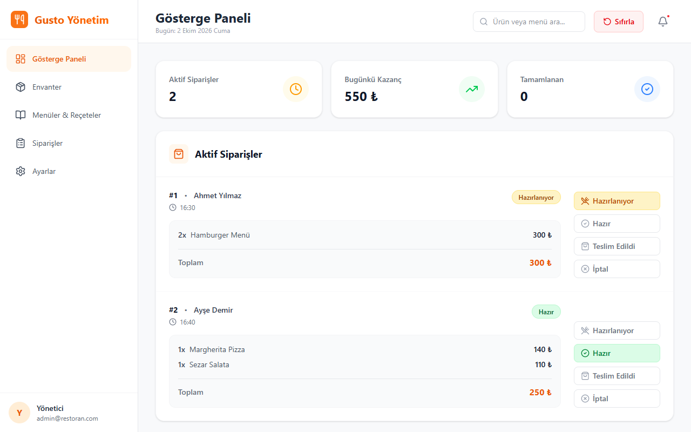
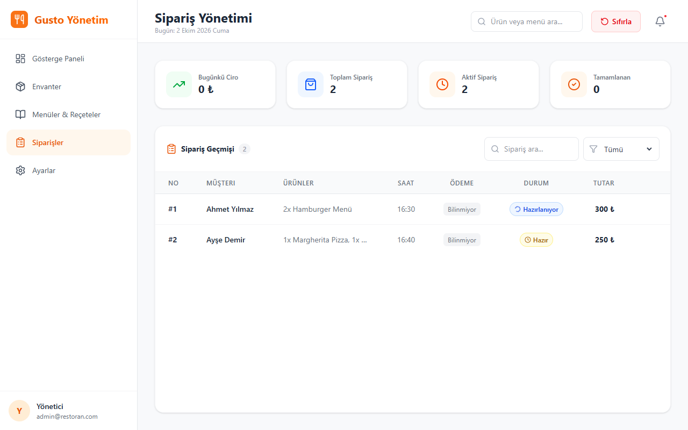
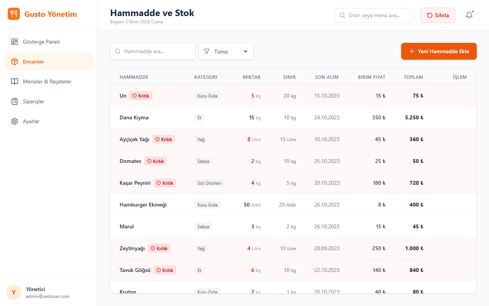
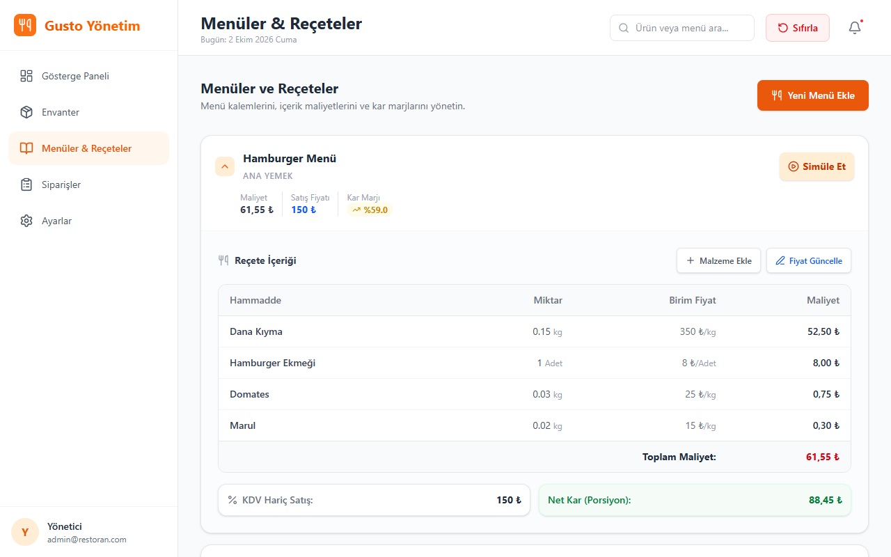

# 🍽 Restaurant Management Dashboard

A fast, dynamic and user-friendly management panel for modern restaurant operations.

[](https://gusto-restaurant-dashboard.vercel.app)


## 📖 About

The dashboard lets a restaurant follow its daily order traffic, menu and financial statistics in one place. It is built around a global state (React Context API), and orders come from a simulated data stream, so you can take orders, manage stock and watch the restaurant's traffic right away.

## 📸 Screenshots

The interface is in Turkish and starts with demo data (the "Sıfırla" button resets it).

| Dashboard | Orders |
|---|---|
|  |  |

| Inventory with low-stock alerts | Menu, recipes and profit margins |
|---|---|
|  |  |

## ✨ Features

- 🧾 **Live order management:** new orders appear instantly and move through preparing / completed statuses
- 📦 **Dynamic inventory:** stock is reduced automatically from incoming orders and recipe ingredients
- 📊 **Financial statistics:** daily revenue, order volume and table occupancy
- 📖 **Menu management:** products, pricing and recipe simulation

## 🛠 Tech stack

| Technology | Purpose |
| :--- | :--- |
| **React 19** | Modern, fast and maintainable UI |
| **TypeScript** | Static typing for type-safe code |
| **Context API** | Lightweight global state management |
| **Tailwind CSS** | Responsive, mobile-friendly styling |
| **Vite** | Dev server and build tool |
| **Vercel** | Deployment |

## 🚀 Getting started

```bash
git clone https://github.com/yusuf-koyuncu/Restoran-Dashboard.git
cd Restoran-Dashboard
npm install
npm run dev
```

Then open `http://localhost:5173`.

---
Developed by [Yusuf Koyuncu](https://github.com/yusuf-koyuncu)
